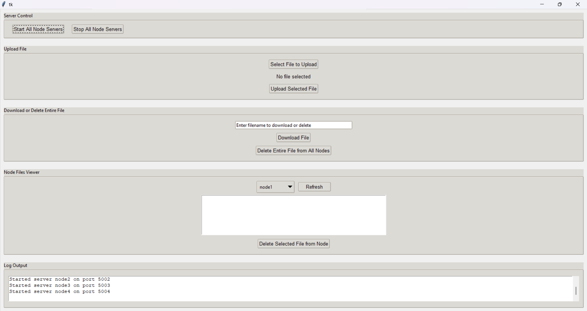
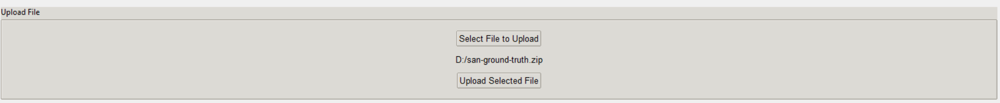
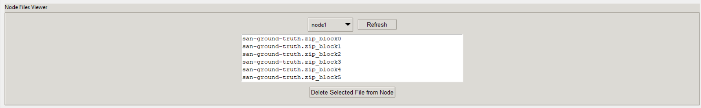
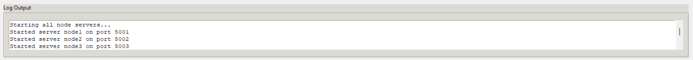

# Distributed File System (DFS) with GUI

This project is a **basic Distributed File System prototype** designed for academic purposes. It demonstrates:

- ✅ File Upload & Download  
- ✅ Block-level File Splitting (128MB)  
- ✅ Full File Replication Across 4 Nodes  
- ✅ Version-based Consistency  
- ✅ User-Friendly GUI (Tkinter)  

---

## 📸 GUI Preview

<table>
  <tr>
    <td></td>
    <td></td>
  </tr>
  <tr>
    <td align="center">Main Dashboard</td>
    <td align="center">Upload File Panel</td>
  </tr>
  <tr>
    <td></td>
    <td></td>
  </tr>
  <tr>
    <td align="center">Node File Viewer</td>
    <td align="center">Log Output</td>
  </tr>
</table>

---

## 🛠️ Setup

### 1. Install dependencies

```bash
pip install -r requirements.txt
```

Example contents of `requirements.txt`:

```
flask
requests
tk
```

---

### 2. Launch the GUI Client

```bash
python client_gui.py
```

Use the GUI to:

- Start/stop node servers  
- Upload files (split + replicate)  
- Download files (reassemble blocks)  
- View/delete node files  
- Monitor activity logs  

---

### 3. Start Node Servers (from GUI)

Each node runs a Flask server locally:

```bash
python node_server.py node1 5001
python node_server.py node2 5002
python node_server.py node3 5003
python node_server.py node4 5004
```

> 🗂 These will create storage folders in `node_storage/` for each node

---

## 📁 File Structure

```bash
distributed-dfs/
├── client_gui.py          # Tkinter GUI
├── node_server.py         # Flask Node Server
├── config.json            # Node metadata
├── dfs_metadata.json      # Uploaded file metadata
├── node_storage/          # Auto-created storage per node
├── images/                # GUI screenshots
└── requirements.txt
```

---

## ⚙️ How It Works

1. **Upload:** File split into 128MB blocks → each block replicated to 4 nodes  
2. **Metadata:** `dfs_metadata.json` keeps track of blocks, versions, nodes  
3. **Download:** GUI fetches blocks from available nodes and reassembles  
4. **Delete:** Removes blocks from nodes and cleans up metadata  

---

## 🧪 Sample `config.json`

```json
{
  "nodes": [
    {"id": "node1", "host": "localhost", "port": 5001},
    {"id": "node2", "host": "localhost", "port": 5002},
    {"id": "node3", "host": "localhost", "port": 5003},
    {"id": "node4", "host": "localhost", "port": 5004}
  ],
  "replication_factor": 4
}
```

---

## 🧹 Tips

- Use the GUI's "Stop All Servers" button to cleanly terminate Flask servers.  
- Logs and actions are updated in real time in the log window.  

---

## 📜 License

MIT License — feel free to reuse, modify, or extend for educational or learning purposes.
